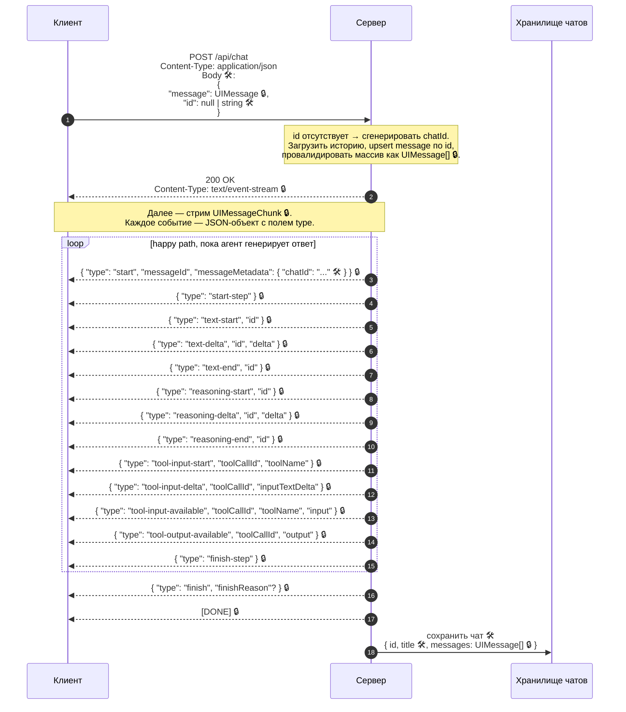
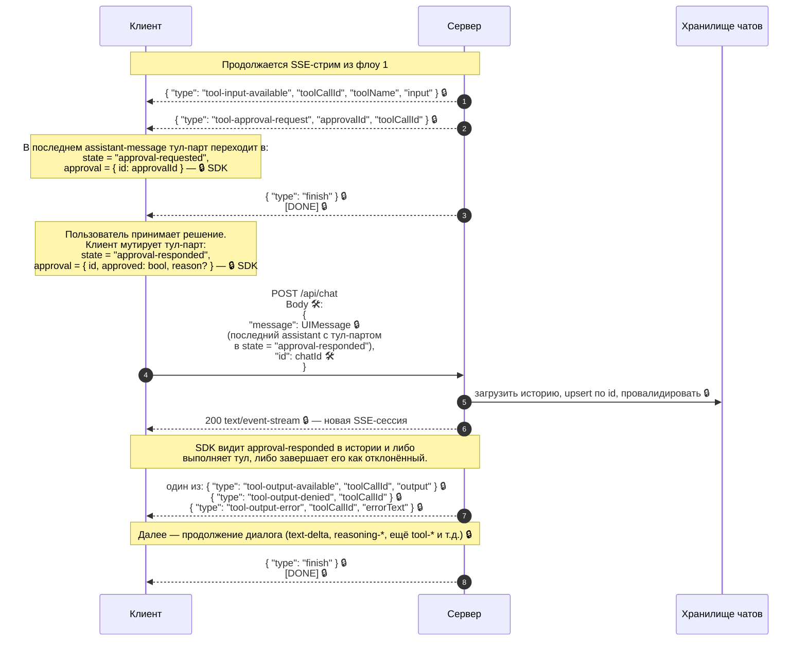
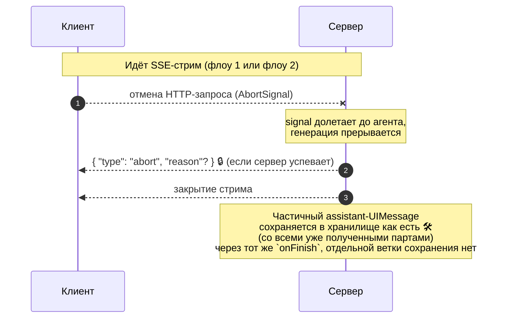

# Контракт «фронт ↔ бэк»: что диктует AI SDK, а что определили мы

Документ описывает сетевой контракт чата без привязки к языку и фреймворку. Часть контракта жёстко задана протоколом **AI SDK UI Message Streaming** (пакет `ai`); остальное — прикладной слой.

Легенда:

- 🔒 **SDK** — форма поля/события фиксирована протоколом AI SDK. Менять в одностороннем порядке нельзя.
- 🛠 **Наше** — определено в этом проекте, SDK это не типизирует и не валидирует. Менять можно, но клиент и сервер нужно обновлять согласованно: SDK не проверяет, что с обеих сторон ожидается одна и та же JSON-структура.

---

## 1. Поверхность API

| Метод | URL               | Назначение                 | Транспорт ответа                 |
|-------|-------------------|----------------------------|----------------------------------|
| POST  | `/api/chat`       | Отправка сообщения / аппрув | **SSE** (`text/event-stream`) 🔒 |
| GET   | `/api/chats`      | Список чатов               | HTTP JSON 🛠                     |
| GET   | `/api/chats/{id}` | История одного чата        | HTTP JSON 🛠                     |

Ключевая разница: диалог идёт **стримом SSE-событий**, история и список — **однократными JSON-ответами**.

---

## 2. Модель данных `UIMessage` — 🔒 SDK

Единица переписки. В истории и в хранилище лежит именно `UIMessage`; в SSE по проводу идёт поток `UIMessageChunk`, из которого клиент собирает `UIMessage`.

```text
UIMessage
├── id        : string                                      🔒 SDK
├── role      : "system" | "user" | "assistant"             🔒 SDK
├── metadata? : unknown                                     🔒 SDK (дженерик-слот, SDK не типизирует)
│   └── chatId? : string                                    🛠 наш ключ (сервер кладёт только на событии start, см. §3)
└── parts     : UIMessagePart[]                             🔒 SDK
```

Варианты `UIMessagePart` (дискриминатор — `type`):

```text
{ type: "text",            text, state?: "streaming"|"done" }                        🔒
{ type: "reasoning",       text, state?: "streaming"|"done" }                        🔒
{ type: "file",            mediaType, url, filename? }                               🔒
{ type: "source-url",      sourceId, url, title? }                                   🔒
{ type: "source-document", sourceId, mediaType, title, filename? }                   🔒
{ type: "step-start" }                                                               🔒
{ type: "data-<name>",     id?, data }                                               🔒
{ type: "dynamic-tool",    toolName, toolCallId, state, input, ... }                 🔒
{ type: "tool-<name>",     toolCallId, state, input, ... }                           🔒
```

Для tool-part'ов строки выше сокращены: помимо `state`/`input`/`output`/`approval`, в зависимости от состояния и режима там могут присутствовать `errorText`, `rawInput`, `title`, `providerExecuted`, `callProviderMetadata`, `resultProviderMetadata`, `preliminary`, а у `dynamic-tool` `toolName` обязателен всегда.

Состояние тул-парта (`tool-*` / `dynamic-tool`) — конечный автомат, всё 🔒 SDK:

```text
input-streaming   -> input-available | output-error
input-available   -> output-available | output-error | approval-requested
approval-requested -> approval-responded
approval-responded -> output-available | output-error | output-denied
```

`approval` появляется начиная с `approval-requested` и сопровождает парт до конечного состояния. Его форма зависит от `state`:

```text
approval-requested  -> { id: string }                                           🔒
approval-responded  -> { id: string, approved: boolean, reason?: string }       🔒
output-available    -> { id: string, approved: true,  reason?: string }         🔒 (опционально)
output-error        -> { id: string, approved: true,  reason?: string }         🔒 (опционально)
output-denied       -> { id: string, approved: false, reason?: string }         🔒
```

`approval.id` совпадает с `approvalId` из SSE-события `tool-approval-request`.

**Корреляция чанков с партами.** События SSE несут `id`, по которому клиент адресует конкретный парт в собираемом `UIMessage.parts[]`: `text-start.id` = `text-delta.id` = `text-end.id`; то же для `reasoning-*`. Для всех `tool-*` событий роль корреляционного ключа играет `toolCallId`. Для стримящихся частей порядок обязателен: `text-start → text-delta* → text-end`, `reasoning-start → reasoning-delta* → reasoning-end`. Для tool input жёсткое требование только одно: `tool-input-delta` не может прийти без предшествующего `tool-input-start`; `tool-input-available` может прийти как после `tool-input-start`/`tool-input-delta*`, так и сразу готовым значением.

**Файлы.** `FileUIPart` передаётся inline: поле `url` — либо ссылка на хостинг, либо data-URL (`data:<mediaType>;base64,...`). Отдельного multipart-канала или эндпоинта загрузки SDK не вводит; файл включается прямо в `UIMessage.parts` и сохраняется вместе с сообщением.

---

## 3. Флоу 1 — новый чат и первое сообщение



### Мульти-степ: почему событий `start-step` / `finish-step` может быть несколько

Агент настроен как tool-loop с `stopWhen: stepCountIs(10)`: в одном HTTP-ответе может быть до 10 итераций модели. Каждая итерация бракетится парой `start-step`/`finish-step` 🔒, внутри которой появляются свои `text-*`, `reasoning-*`, `tool-*` события. То есть один assistant-`UIMessage` в итоге может содержать несколько `TextUIPart`/`ReasoningUIPart`/тул-партов — это нормальное состояние, а не несколько «сообщений».

### Диаграмма выше — только happy path

Полный перечень легальных `UIMessageChunk.type` шире, чем на диаграмме:

- Текст: `text-start`, `text-delta`, `text-end` 🔒
- Reasoning: `reasoning-start`, `reasoning-delta`, `reasoning-end` 🔒
- Tool input: `tool-input-start`, `tool-input-delta`, `tool-input-available`, `tool-input-error` 🔒
- Tool approval / result: `tool-approval-request`, `tool-output-available`, `tool-output-error`, `tool-output-denied` 🔒
- Источники и файлы: `source-url`, `source-document`, `file` 🔒
- Произвольные data parts: `data-<name>` 🔒
- Границы сообщения/шага: `start`, `start-step`, `finish-step`, `finish`, `abort`, `message-metadata` 🔒
- Общая ошибка стрима: `error` 🔒
- `tool-approval-request` может возникнуть уже в первом `POST /api/chat`, а не только после повторного запроса с аппрувом.

SDK допускает `messageMetadata` и в `start`, и в `finish`, а также отдельным чанком `message-metadata`. В этом проекте `app/api/chat/route.ts` кладёт `{ chatId }` только на `part.type === "start"`, поэтому на `finish` метадата у нас обычно отсутствует.

### Почему в теле одно сообщение, а не массив

Рецепт из документации SDK (`docs/04-ai-sdk-ui/03-chatbot-message-persistence.mdx`, раздел **Sending only the last message**):

> Once you have implemented message persistence, you might want to send only the last message to the server. This reduces the amount of data sent to the server on each request and can improve performance.

Сервер хранит историю, поэтому передавать её целиком на каждый запрос не требуется. Но сами ключи `message`/`id` SDK не типизирует: их форма — наш прикладной контракт.

При сохранении сервер вычисляет `title` прикладным правилом: берёт первый `TextUIPart` у первого сообщения с `role === "user"`, делает `trim().slice(0, 100)`, а если текста нет — использует `"New chat"`.

Для сообщений из storage AI SDK рекомендует `validateUIMessages`. В этом проекте невалидный чат считается повреждённым и возвращает ошибку валидации.

---

## 4. Флоу 2 — аппрув инструмента

Отдельного эндпоинта нет. Аппрув — это новый `POST /api/chat` с тем же `chatId`, где последний assistant-`UIMessage` приходит с тул-партом, переведённым в состояние `approval-responded`.



Корреляция — по `toolCallId` и `approvalId` (оба 🔒 SDK). Сам механизм «аппрув через мутацию тул-парта и повторный POST того же `UIMessage`» — часть SDK-протокола; своего эндпоинта или payload с `{approved: ...}` на корневом уровне мы не делаем.

---

## 5. Отмена стрима

Отмена оформляется не как простое разрывание соединения, а как часть SDK-протокола.



Контракт: сервер должен корректно обрабатывать `AbortSignal` (у нас — `abortSignal: req.signal`); клиент, в свою очередь, исходит из того, что прерванный стрим не делает уже отрисованные парты неконсистентными. События после `abort` не приходят.

---

## 6. Ошибки и retry

В SSE-стриме есть три категории ошибок, все 🔒 SDK:

```text
{ type: "error",             "errorText" }                                         — общая ошибка стрима
{ type: "tool-input-error",  "toolCallId", "toolName", "input", "errorText" }      — не смогли собрать input тула
{ type: "tool-output-error", "toolCallId", "errorText" }                           — тул упал при исполнении
```

Первый закрывает весь ответ; последние два — локальные к тул-парту (парт уходит в состояние `output-error` с `errorText`). Дальнейший диалог после `tool-*-error` может продолжиться: агент решает сам.

`tool-output-denied` не считается ошибкой стрима: это штатное конечное состояние `output-denied`, когда аппрув пришёл с `approved: false`.

**Retry** на нашей стороне — это повторный `POST /api/chat` через SDK-шный `regenerate`. В обычных условиях SDK добавляет в тело два поля 🔒:

```text
trigger:   "submit-message" | "regenerate-message"
messageId: string | undefined    (id assistant-сообщения, которое перегенерируют)
```

Наш `prepareSendMessagesRequest` эти поля **отбрасывает** — бэкенд видит regenerate и обычный send как один и тот же `{ message, id }`-запрос. Если появится потребность реально различать «новое сообщение» и «перегенерируй последнее», `trigger`/`messageId` придётся пробрасывать вручную.

---

## 7. История чата

`GET /api/chats/{id}` и `GET /api/chats` — обычные JSON-эндпоинты. Их форма, имена ключей, 404, `422 invalid stored chat` и сортировка — целиком прикладные: SDK для истории никаких транспортов или helper'ов не предлагает.

Единственная точка, где SDK всё-таки участвует, — массив `messages` в ответе `GET /api/chats/{id}`: это тот же `UIMessage[]` 🔒, который клиент собирает из SSE-чанков и затем сохраняет в флоу 1–2. Из него клиент на mount-е восстанавливает состояние чата (включая уже завершённые тул-парты с `output-available`/`output-denied`) без повторного запроса к модели.
